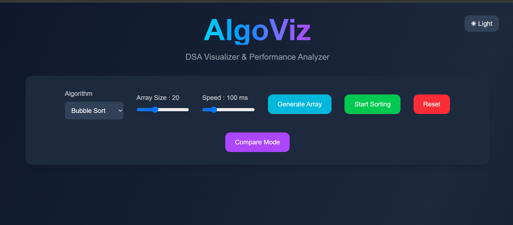
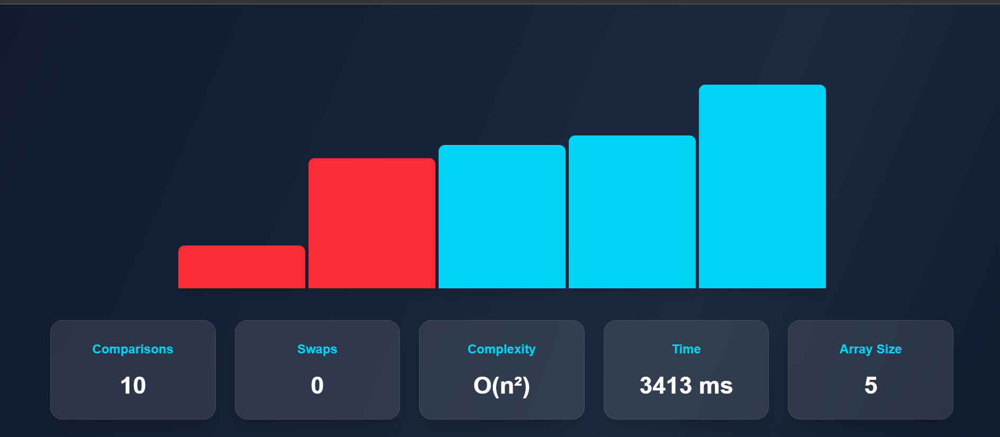
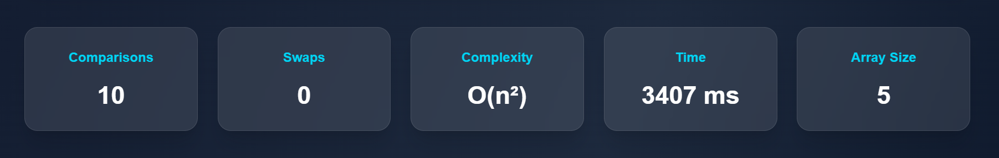
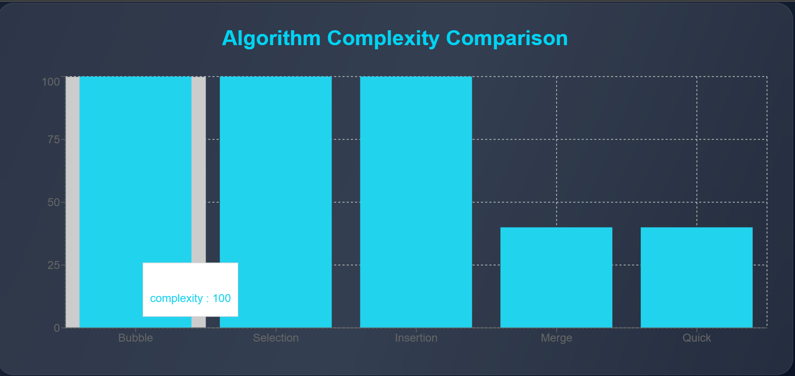
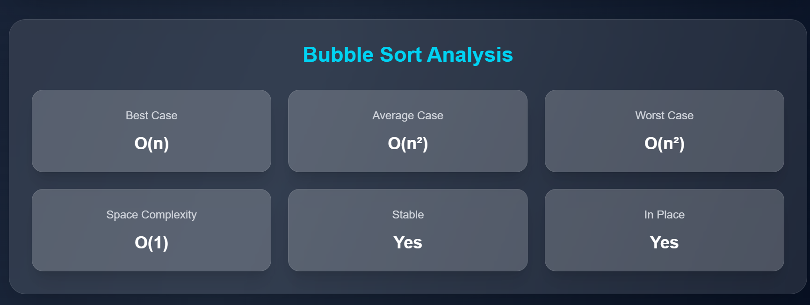
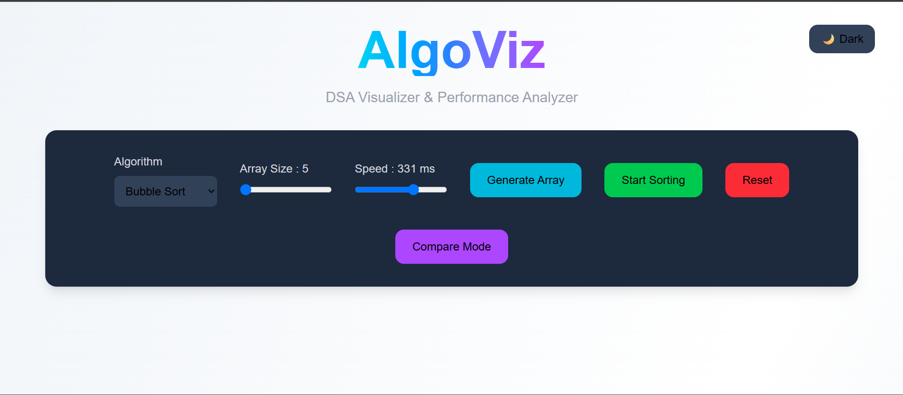
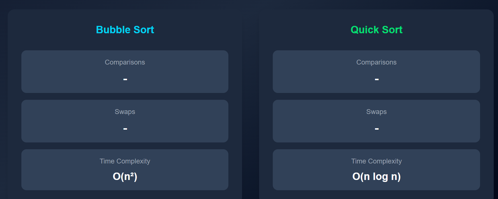

# 🚀 AlgoViz — DSA Visualizer & Performance Analyzer

AlgoViz is an interactive web application built to make sorting algorithms easier to understand through animations and real-time analytics. Instead of just reading about algorithms, users can actually see how they work, compare their behavior, and analyze their performance.

Built with **React, TypeScript, Tailwind CSS, and Recharts**, the project combines algorithm visualization with a modern and responsive UI.

---
## 🌐 Live Demo

🔗 https://algo-viz-kappa-ten.vercel.app

## ✨ Features

### 📌 Sorting Algorithms
- Bubble Sort
- Selection Sort
- Insertion Sort
- Merge Sort
- Quick Sort

### 📊 Performance Insights
- Comparison count
- Swap count
- Execution time
- Array size analysis

### 📈 Algorithm Analysis
- Complexity comparison chart
- Best, average and worst case complexities
- Space complexity
- Stability analysis
- In-place property information

### 🎨 Interactive UI
- Dark mode support
- Glassmorphism-inspired design
- Responsive layout
- Sorting completion animation
- Adjustable speed and array size

### ⚡ Additional Functionality
- Compare mode
- Reset functionality
- Active bar highlighting
- Sorted bars animation

---

## 🛠 Tech Stack

| Technology | Purpose |
|------------|----------|
| React | Frontend Framework |
| TypeScript | Type Safety |
| Tailwind CSS | Styling |
| Recharts | Data Visualization |
| Vite | Build Tool |

---

## 📂 Project Structure
```
src
│
├── algorithms
├── components
├── App.tsx
├── main.tsx
└── index.css
```

---

## 🧠 Algorithms Implemented

| Algorithm | Best Case | Average Case | Worst Case | Stable |
|------------|-----------|--------------|------------|--------|
| Bubble Sort | O(n) | O(n²) | O(n²) | ✅ |
| Selection Sort | O(n²) | O(n²) | O(n²) | ❌ |
| Insertion Sort | O(n) | O(n²) | O(n²) | ✅ |
| Merge Sort | O(n log n) | O(n log n) | O(n log n) | ✅ |
| Quick Sort | O(n log n) | O(n log n) | O(n²) | ❌ |

---

## ⚙️ Getting Started

Clone the repository

```bash
git clone https://github.com/ananyasatyapal08/AlgoViz.git
```

Install dependencies

```bash
npm install
```

Run the development server

```bash
npm run dev
```

---

## 📷 Screenshots

### 🏠 Home Page



### 🔄 Sorting Visualization



### 📊 Performance Dashboard



### 📈 Complexity Chart



### 🧠 Algorithm Analysis



### 🌙 Dark Mode



### ⚡ Compare Mode



---

## 🚀 Future Improvements

- Heap Sort Visualization
- Searching Algorithms
- Binary Tree Visualizer
- Graph Algorithms Visualizer
- Pathfinding Algorithms
- Framer Motion Animations

---

## 💭 What I Learned

While building AlgoViz, I explored:

- React hooks and state management
- TypeScript interfaces and props
- Component-based architecture
- Data visualization using Recharts
- Responsive UI design with Tailwind CSS
- Algorithm analysis and complexity comparison

⭐ If you found this project interesting, consider giving it a star!